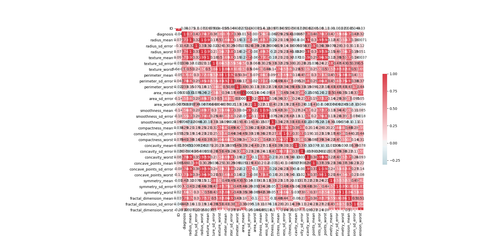
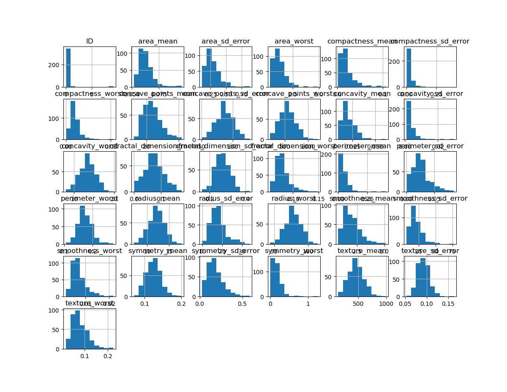

# Breast-Cancer-Prediction-Model
A simple model to predict Malignant and Benign Tumors in Breast Cancer Prediction. 

This repository contains simple analysis of a Breast Cancer Dataset which is a publicaly available dataset and can be found here: (https://www.kaggle.com/uciml/breast-cancer-wisconsin-data)

The major steps include: 

1. First making a dataframe. I attached the header which was present in a .txt file to the csv datafile.
2. The next step was to do a simple analysis of the data. e.g. Finding mean and median etc. 
3. The third step included visualizing the dataset and finding different relationships between the different parameters. Here are just two examples of the histograms and the heatmaps which I generated. 

  

  

The heatmaps tell us which of the parameters can be helpful in predicting which kind of tumors (malignant & benign).

4. The last step was to use a logistic regression model in order to predict the correct class **1 : Malignant Tumor** & **2 : Benign Tumor**.

5. I was able to achieve an accuracy of 99 percent with this simple model. I will be adding more models in the future to test with different kinds of models. 
